# UniqueBrains Backend Architecture & Data Flow

## System Architecture Overview

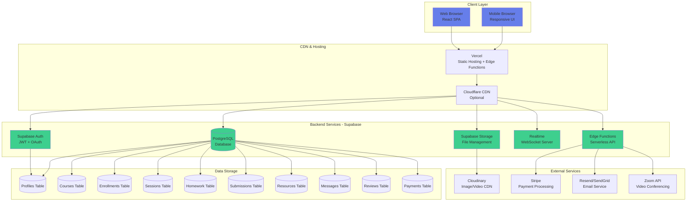

## Data Flow Diagrams

### 1. User Authentication Flow

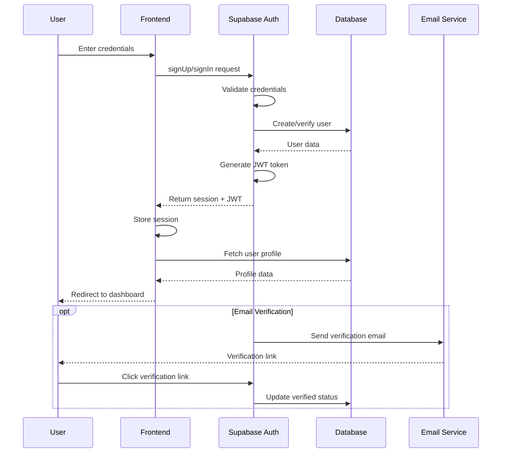

### 2. Course Creation & Publishing Flow

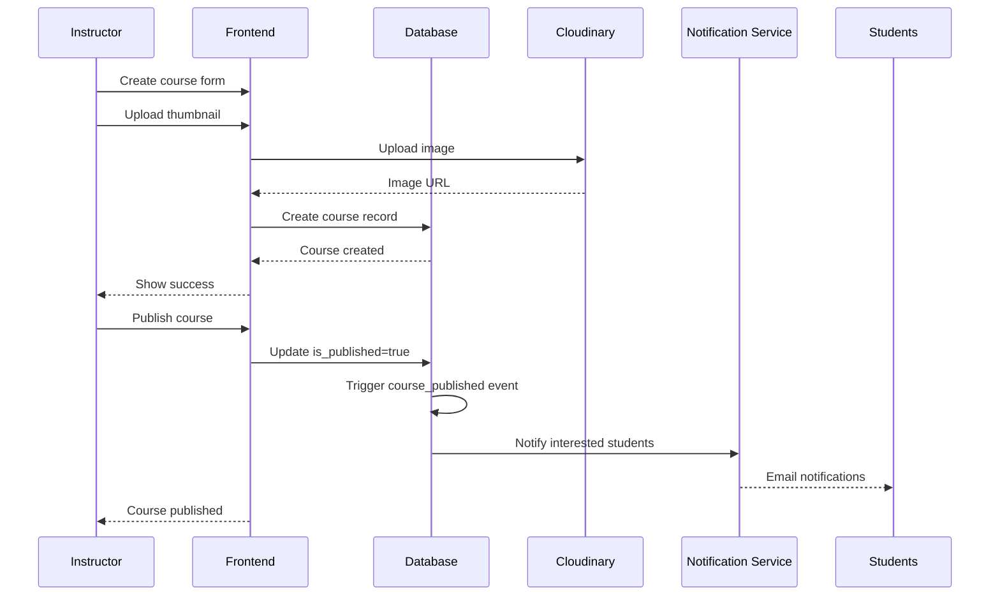

### 3. Student Enrollment Flow

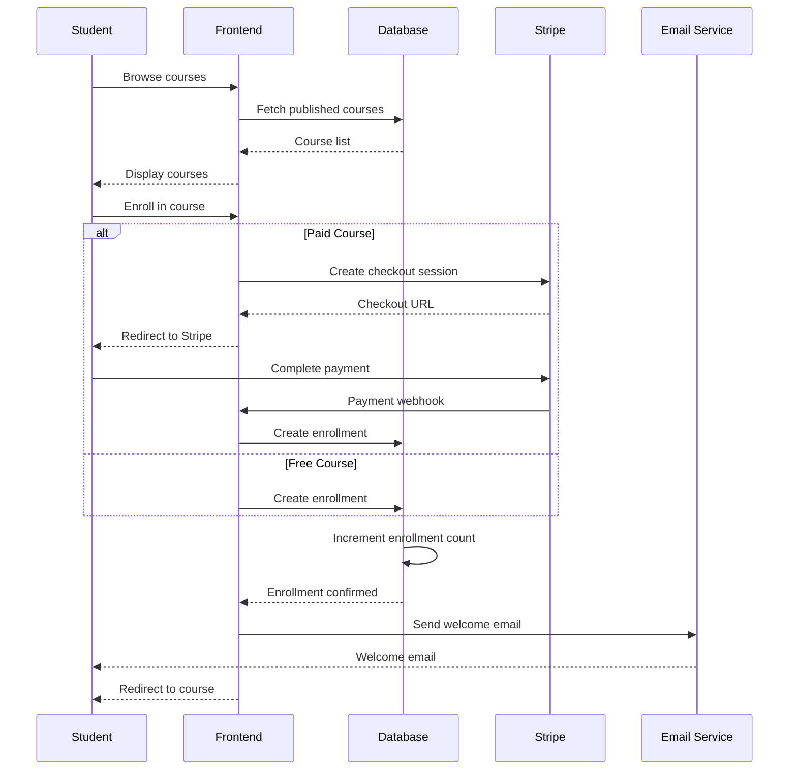

### 4. Homework Submission & Feedback Flow

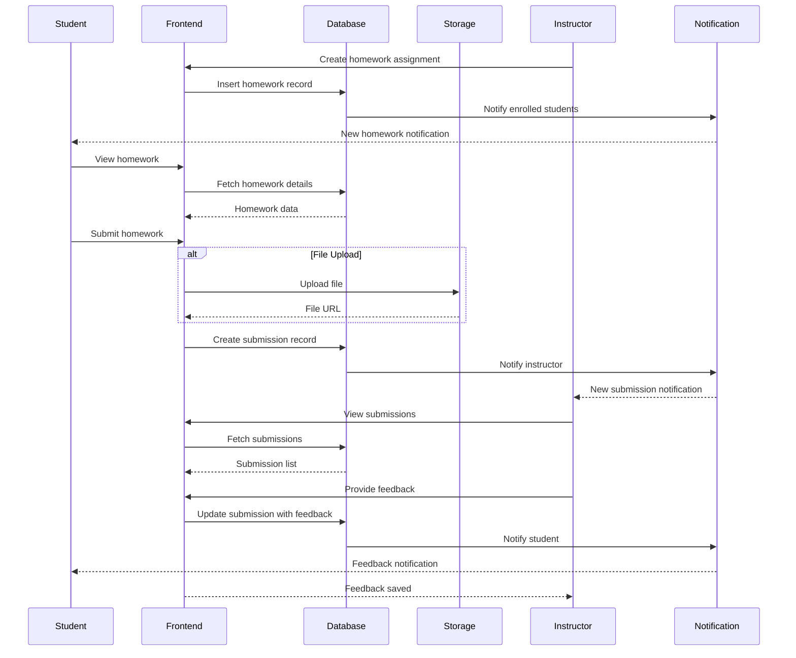

### 5. Real-time Chat Flow

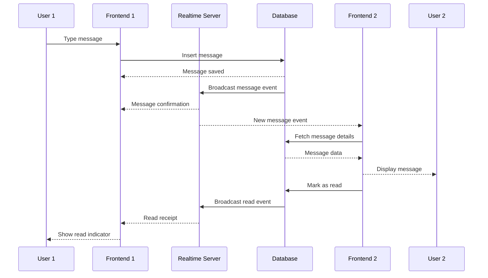

### 6. Session Scheduling Flow

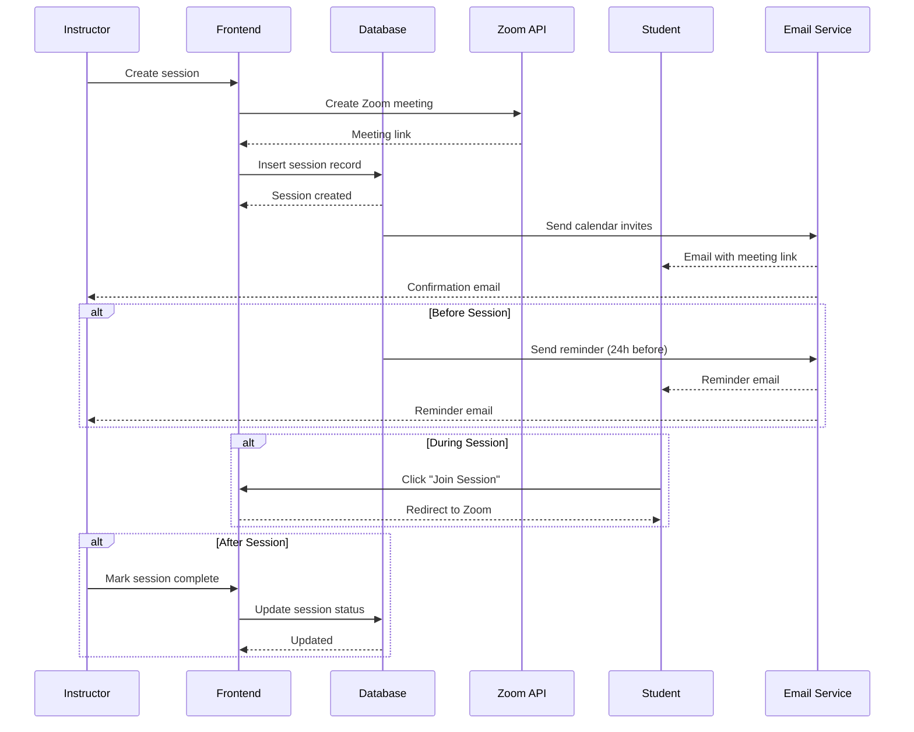

### 7. Resource Sharing Flow

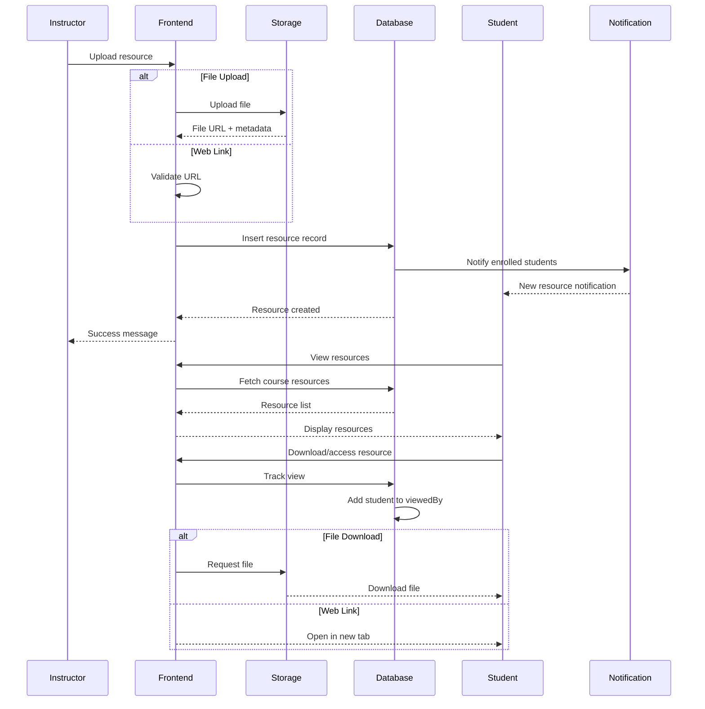

## Database Schema Relationships

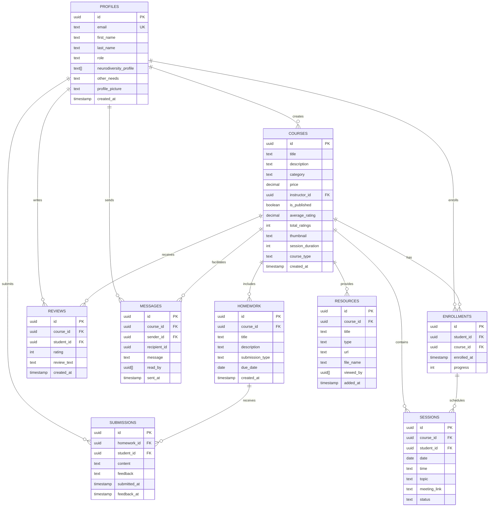

## API Endpoints Architecture

### REST API Endpoints (via Supabase)

```
Authentication:
POST   /auth/signup              - Register new user
POST   /auth/signin              - Login user
POST   /auth/signout             - Logout user
POST   /auth/reset-password      - Request password reset
PUT    /auth/update-password     - Update password

Profiles:
GET    /profiles/:id             - Get user profile
PUT    /profiles/:id             - Update profile
GET    /profiles/instructor/:id  - Get instructor details

Courses:
GET    /courses                  - List all published courses
GET    /courses/:id              - Get course details
POST   /courses                  - Create course (instructor)
PUT    /courses/:id              - Update course (instructor)
DELETE /courses/:id              - Delete course (instructor)
GET    /courses/instructor/:id   - Get instructor's courses

Enrollments:
GET    /enrollments/student/:id  - Get student enrollments
POST   /enrollments              - Enroll in course
DELETE /enrollments/:id          - Unenroll from course

Sessions:
GET    /sessions/course/:id      - Get course sessions
POST   /sessions                 - Create session (instructor)
PUT    /sessions/:id             - Update session
DELETE /sessions/:id             - Delete session

Homework:
GET    /homework/course/:id      - Get course homework
POST   /homework                 - Create homework (instructor)
PUT    /homework/:id             - Update homework
DELETE /homework/:id             - Delete homework

Submissions:
GET    /submissions/homework/:id - Get homework submissions
POST   /submissions              - Submit homework (student)
PUT    /submissions/:id          - Update submission feedback

Resources:
GET    /resources/course/:id     - Get course resources
POST   /resources                - Add resource (instructor)
DELETE /resources/:id            - Delete resource

Messages:
GET    /messages/course/:id      - Get course messages
POST   /messages                 - Send message
PUT    /messages/:id/read        - Mark as read

Reviews:
GET    /reviews/course/:id       - Get course reviews
POST   /reviews                  - Create review
PUT    /reviews/:id              - Update review
```

### Realtime Subscriptions (via Supabase Realtime)

```
Channels:
course:{courseId}:messages       - Real-time chat messages
course:{courseId}:updates        - Course content updates
user:{userId}:notifications      - User notifications
session:{sessionId}:status       - Session status updates
```

## Security Architecture

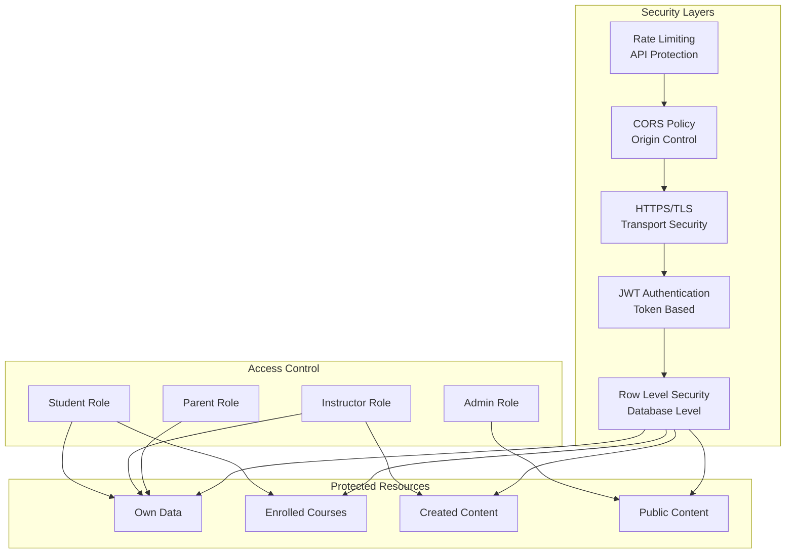

## Deployment Architecture

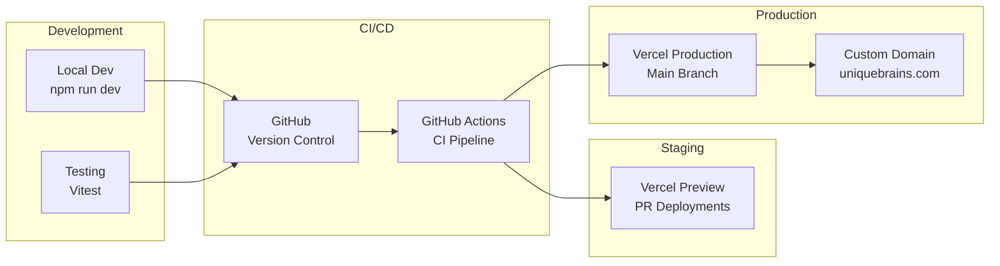

## Performance Optimization

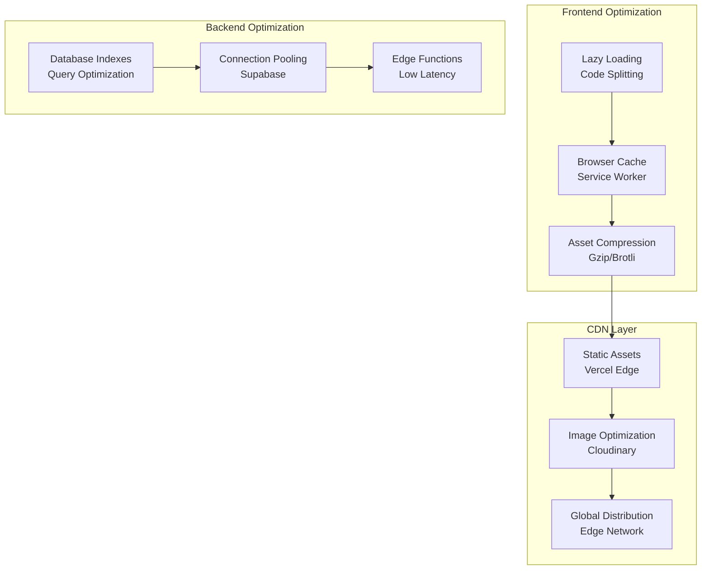

## Monitoring & Observability

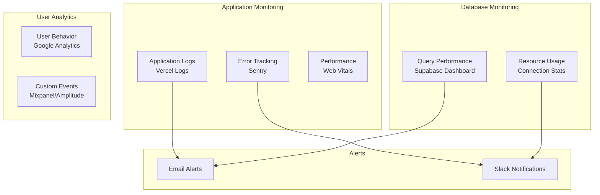

## Scalability Strategy

### Current Architecture (Free Tier)
- **Users**: Up to 50k MAU
- **Database**: 500MB storage
- **Bandwidth**: 2GB/month
- **Storage**: 1GB files

### Growth Path

```
Phase 1: 0-1000 users (Free Tier)
├── Supabase Free
├── Vercel Free
└── Cloudinary Free

Phase 2: 1000-10000 users ($50/month)
├── Supabase Pro ($25/month)
├── Vercel Pro ($20/month)
└── Cloudinary Plus ($5/month)

Phase 3: 10000+ users ($200+/month)
├── Supabase Team ($599/month)
├── Vercel Team ($20/user/month)
├── Cloudinary Advanced ($99/month)
└── Dedicated Redis Cache
```

## Technology Stack Summary

| Layer | Technology | Purpose | Cost |
|-------|-----------|---------|------|
| Frontend | React + Vite | UI Framework | Free |
| Hosting | Vercel | Static Hosting | Free |
| Database | Supabase PostgreSQL | Data Storage | Free |
| Auth | Supabase Auth | User Management | Free |
| Storage | Supabase Storage + Cloudinary | File Storage | Free |
| Realtime | Supabase Realtime | WebSocket | Free |
| Payments | Stripe | Payment Processing | Transaction fees |
| Email | Resend/SendGrid | Transactional Email | Free (100/day) |
| Video | Zoom API | Video Conferencing | Pay per use |
| CDN | Vercel Edge + Cloudflare | Content Delivery | Free |
| Monitoring | Sentry | Error Tracking | Free |
| Analytics | Google Analytics | User Analytics | Free |

**Total Monthly Cost: $0-12** (just domain registration)
