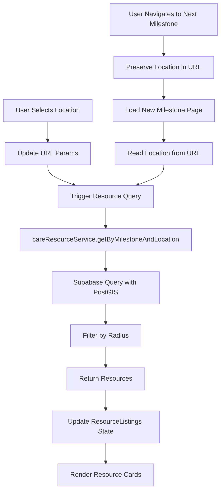

# Design Document: Care Roadmap

## Overview

The Care Roadmap feature provides an interactive, location-aware journey through neurodiversity care stages. The system consists of three main components: a timeline landing page showing all milestones, individual milestone pages with interactive maps, and a location-based resource listing system. The feature integrates into the existing UniqueBrains platform navigation and follows established patterns for routing, styling, and data management.

### Key Design Decisions

1. **Map Library Selection**: Use Leaflet.js with React-Leaflet for the interactive map component. Leaflet is lightweight, open-source, has excellent mobile support, and doesn't require API keys for basic functionality (using OpenStreetMap tiles).

2. **Data Storage**: Create new database tables for care resources rather than extending existing course/content tables, ensuring clean separation of concerns and optimized queries.

3. **Location Handling**: Store coordinates (latitude/longitude) for each resource and use PostGIS extensions in PostgreSQL for efficient geographic queries and radius-based filtering.

4. **Progressive Enhancement**: Load the map component lazily to improve initial page load performance, with a skeleton placeholder during loading.

5. **State Management**: Use URL parameters to persist selected location across milestone navigation, allowing users to maintain their location context when exploring different stages.

6. **School Milestone Split**: Separate "School" into "Primary School" and "Secondary School" to provide more targeted resources for different educational stages, resulting in eight total milestones.

## Architecture

### Component Hierarchy

```
App
└── Layout
    └── CareRoadmap (Routes)
        ├── CareTimeline (Landing Page)
        │   └── MilestoneCard (x7)
        │
        └── MilestonePage (Individual Stage)
            ├── MilestoneHero
            │   └── InteractiveMap
            │       ├── MapContainer (Leaflet)
            │       ├── LocationSearch
            │       └── LocationMarkers
            │
            ├── MilestoneNavigation
            │   ├── PreviousButton
            │   ├── BackToTimelineButton
            │   └── NextButton
            │
            └── ResourceListings
                ├── LocationFilter
                ├── ResourceCard (x N)
                └── EmptyState
```

### Data Flow



### Routing Structure

```
/care                          → CareTimeline (landing page)
/care/diagnosis                → MilestonePage (milestone="diagnosis")
/care/therapies                → MilestonePage (milestone="therapies")
/care/daycare                  → MilestonePage (milestone="daycare")
/care/primary-school           → MilestonePage (milestone="primary-school")
/care/secondary-school         → MilestonePage (milestone="secondary-school")
/care/college                  → MilestonePage (milestone="college")
/care/trainings                → MilestonePage (milestone="trainings")
/care/jobs                     → MilestonePage (milestone="jobs")

URL Parameters:
?lat=<latitude>&lng=<longitude>&zoom=<zoom_level>
```

## Components and Interfaces

### 1. CareTimeline Component

**Purpose**: Landing page displaying all seven milestones in a visual timeline format.

**Props**: None

**State**:
```typescript
{
  // No complex state needed - static milestone data
}
```

**Key Methods**:
- `handleMilestoneClick(milestone: string)`: Navigate to milestone page

**Rendering**:
- Grid layout of milestone cards (responsive: 1 column mobile, 2-3 columns tablet/desktop)
- Each card shows icon, title, brief description, and visual indicator of position in timeline

### 2. MilestonePage Component

**Purpose**: Individual page for each care stage with Yelp/Airbnb-style layout: filters on left, listings in center, map on right.

**Layout Structure**:
```
┌─────────────────────────────────────────────────────────────────┐
│ [Search Bar] [Country Flags: 🇺🇸 🇮🇳 🇬🇧 ...]                    │
├──────────┬──────────────────────────┬──────────────────────────┤
│          │                          │                          │
│ Filters  │   Resource Listings      │    Interactive Map       │
│ (Left)   │      (Center)            │      (Right)             │
│          │                          │                          │
│ Tags     │   [Resource Card]        │   [Map with markers]     │
│ Rating   │   [Resource Card]        │   [Updates as you        │
│ Distance │   [Resource Card]        │    pan/zoom]             │
│ Verified │   [Resource Card]        │                          │
│          │   [Load More...]         │                          │
│          │                          │                          │
└──────────┴──────────────────────────┴──────────────────────────┘
```

**Props**:
```typescript
{
  milestone: 'diagnosis' | 'therapies' | 'education' | 'trainings' | 'ngo-advocacy' | 'jobs-livelihood'
}
```

**State**:
```typescript
{
  selectedCountry: string | null, // ISO country code (e.g., 'US', 'IN', 'GB')
  availableCountries: string[], // Countries with resources in this milestone
  mapBounds: {
    north: number,
    south: number,
    east: number,
    west: number
  } | null,
  mapCenter: {
    lat: number,
    lng: number,
    zoom: number
  },
  filters: {
    tags: string[],
    minRating: number,
    maxDistance: number,
    verifiedOnly: boolean
  },
  resources: Resource[],
  loading: boolean,
  error: string | null,
  searchQuery: string
}
```

**Key Methods**:
- `handleCountrySelect(countryCode)`: Update map to country bounds and fetch resources
- `handleMapMove(bounds, center)`: Update resources based on visible map area
- `handleFilterChange(filterType, value)`: Update filters and refetch resources
- `handleSearch(query)`: Search for location/resource by name or address
- `fetchResourcesInBounds(milestone, bounds, filters)`: Query resources within map bounds
- `fetchAvailableCountries(milestone)`: Get list of countries with resources

**Behavior**:
- Map updates trigger resource list updates (debounced by 500ms)
- Country flag selector shows only countries with resources for this milestone
- Clicking a country flag centers map on that country
- Filters on left apply to both map markers and list
- Search bar searches both location names and resource names
- Pagination: Load more resources as user scrolls (infinite scroll)

### 3. CountrySelector Component

**Purpose**: Display country flags for quick navigation to countries with resources.

**Props**:
```typescript
{
  availableCountries: string[], // ISO country codes
  selectedCountry: string | null,
  onCountrySelect: (countryCode: string) => void
}
```

**Rendering**:
- Display flag emojis for each available country
- Show country name on hover
- Highlight selected country
- "All Countries" option to show global view
- Dynamically populated based on resources in database

**Country Data**:
```typescript
const COUNTRY_INFO = {
  'US': { name: 'United States', flag: '🇺🇸', center: [39.8283, -98.5795], zoom: 4 },
  'IN': { name: 'India', flag: '🇮🇳', center: [20.5937, 78.9629], zoom: 5 },
  'GB': { name: 'United Kingdom', flag: '🇬🇧', center: [55.3781, -3.4360], zoom: 6 },
  'CA': { name: 'Canada', flag: '🇨🇦', center: [56.1304, -106.3468], zoom: 4 },
  'AU': { name: 'Australia', flag: '🇦🇺', center: [-25.2744, 133.7751], zoom: 4 },
  // Add more as resources are added
}
```

### 4. FilterPanel Component

**Purpose**: Left sidebar with filters for refining resource search.

**Props**:
```typescript
{
  filters: FilterState,
  onFilterChange: (filterType: string, value: any) => void,
  availableTags: string[],
  resourceCount: number
}
```

**Filters**:
- **Tags/Categories**: Checkboxes for autism, ADHD, dyslexia, speech therapy, etc.
- **Rating**: Slider or buttons (4.5+, 4.0+, 3.5+, Any)
- **Distance**: Dropdown (5mi, 10mi, 25mi, 50mi, 100mi, Any)
- **Experience**: Slider (0-30+ years)
- **Verified Only**: Toggle switch
- **Clear All Filters**: Button

**Rendering**:
- Collapsible sections for each filter category
- Show count of resources matching current filters
- Sticky positioning to stay visible while scrolling

### 5. SearchBar Component

**Purpose**: Top search bar for finding resources or locations.

**Props**:
```typescript
{
  onSearch: (query: string) => void,
  placeholder: string,
  initialValue: string
}
```

**Features**:
- Autocomplete suggestions (resource names, locations)
- Search icon and clear button
- Debounced search (300ms)
- "Use My Location" button
- Keyboard navigation (Enter to search, Esc to clear)

### 6. InteractiveMap Component

**Purpose**: Leaflet-based map that updates resource listings as user pans/zooms (Airbnb-style).

**Props**:
```typescript
{
  resources: Resource[],
  mapCenter: { lat: number, lng: number, zoom: number },
  onMapMove: (bounds: MapBounds, center: MapCenter) => void,
  onResourceClick: (resourceId: string) => void,
  selectedResourceId: string | null
}
```

**State**:
```typescript
{
  mapReady: boolean,
  hoveredMarkerId: string | null
}
```

**Key Methods**:
- `handleMapMoveEnd()`: Trigger onMapMove with new bounds and center
- `handleMarkerClick(resourceId)`: Open resource detail modal
- `handleMarkerHover(resourceId)`: Highlight corresponding card in list
- `updateMarkers(resources)`: Display resource markers on map with clustering

**Map Configuration**:
- Tile Layer: OpenStreetMap (no API key required)
- Default Center: Based on selected country or user location
- Default Zoom: 4 (country-level view)
- Min Zoom: 2 (world view), Max Zoom: 18 (street level)
- Marker Clustering: Use react-leaflet-cluster for performance
- Custom Markers: Different colors for rating tiers (green: 4.5+, yellow: 3.5-4.4, gray: <3.5)
- Highlighted Marker: When hovering over card in list

**Behavior**:
- Debounce map move events by 500ms before triggering resource fetch
- Show "Search this area" button when map is moved significantly
- Display resource count in current view
- Sync with resource list (hover, click, selection)

### 4. LocationSearch Component

**Purpose**: Search bar for finding locations by address or place name.

**Props**:
```typescript
{
  onLocationFound: (location: Location) => void,
  placeholder: string
}
```

**Implementation**:
- Use Nominatim API (OpenStreetMap's geocoding service) for address search
- Debounce search input (300ms) to reduce API calls
- Display autocomplete suggestions
- Handle "Use My Location" button for geolocation

### 5. ResourceListings Component

**Purpose**: Display filtered list of care resources based on selected location.

**Props**:
```typescript
{
  resources: Resource[],
  loading: boolean,
  selectedLocation: Location | null,
  milestone: string
}
```

**State**:
```typescript
{
  sortBy: 'distance' | 'name' | 'rating',
  filterRadius: number // in miles: 10, 25, 50, 100
}
```

**Key Methods**:
- `handleSort(sortBy)`: Re-order resources
- `handleRadiusChange(radius)`: Update filter radius and trigger new query

### 6. ResourceCard Component

**Purpose**: Individual resource display card with compact view and detailed modal.

**Props**:
```typescript
{
  resource: Resource,
  userLocation: Location | null,
  onCardClick: (resourceId: string) => void
}
```

**Compact Card View (Milestone Page)**:
- Resource name (heading)
- Star rating (1-5 stars) with review count (e.g., "4.5 ⭐ (23 reviews)")
- Experience (years) - displayed as "15 years experience"
- Tags/categories (max 3 visible, "+2 more" if additional)
- Verified badge (if resource is verified)
- Entire card is clickable to open detail view

**Detail View (Modal or Separate Page)**:
- Full resource name and verified badge
- Star rating and review count
- Experience (years)
- Full description
- Complete address with "View on Map" link
- Phone number (clickable tel: link)
- Email address (clickable mailto: link)
- Website (clickable external link with icon)
- Distance from selected location (if available)
- All tags/categories
- Reviews section:
  - List of user reviews with ratings
  - Review text and reviewer name
  - Review date
  - "Write a Review" button (if user is logged in)

**Styling**:
- Compact card layout to fit 3-4 cards per row on desktop
- Similar visual style to course cards
- Rating displayed prominently
- Star icons for visual rating representation
- Review count in muted text next to rating
- Hover effect to indicate clickability
- Modal overlay for detail view with close button

### 7. MilestoneNavigation Component

**Purpose**: Navigation controls for moving between milestones.

**Props**:
```typescript
{
  currentMilestone: string,
  selectedLocation: Location | null
}
```

**Rendering**:
- Previous button (disabled on first milestone)
- "Back to Timeline" button
- Next button (disabled on last milestone)
- Preserve location in URL when navigating

## Data Models

### Database Schema

#### care_resources Table

```sql
CREATE TABLE care_resources (
  id UUID PRIMARY KEY DEFAULT uuid_generate_v4(),
  milestone VARCHAR(50) NOT NULL, -- 'diagnosis', 'therapies', etc.
  name VARCHAR(255) NOT NULL,
  description TEXT,
  address TEXT NOT NULL,
  city VARCHAR(100),
  state VARCHAR(50),
  zip_code VARCHAR(20),
  country VARCHAR(2) NOT NULL, -- ISO 3166-1 alpha-2 country code (e.g., 'US', 'IN', 'GB')
  coordinates GEOGRAPHY(POINT, 4326) NOT NULL, -- PostGIS type for lat/lng
  phone VARCHAR(50),
  email VARCHAR(255),
  website VARCHAR(500),
  experience_years INTEGER, -- Years of experience (e.g., 15)
  tags TEXT[], -- Array of tags like ['autism', 'adhd', 'speech-therapy']
  rating DECIMAL(2,1), -- Average rating 0.0-5.0
  review_count INTEGER DEFAULT 0, -- Total number of reviews
  verified BOOLEAN DEFAULT false, -- Admin-verified resource
  created_at TIMESTAMP WITH TIME ZONE DEFAULT NOW(),
  updated_at TIMESTAMP WITH TIME ZONE DEFAULT NOW()
);

-- Indexes for performance
CREATE INDEX idx_care_resources_milestone ON care_resources(milestone);
CREATE INDEX idx_care_resources_country ON care_resources(country);
CREATE INDEX idx_care_resources_milestone_country ON care_resources(milestone, country);
CREATE INDEX idx_care_resources_coordinates ON care_resources USING GIST(coordinates);
CREATE INDEX idx_care_resources_tags ON care_resources USING GIN(tags);
CREATE INDEX idx_care_resources_verified ON care_resources(verified) WHERE verified = true;
CREATE INDEX idx_care_resources_rating ON care_resources(rating DESC);

-- Trigger for updated_at
CREATE TRIGGER update_care_resources_updated_at
  BEFORE UPDATE ON care_resources
  FOR EACH ROW
  EXECUTE FUNCTION update_updated_at_column();
```

#### care_resource_reviews Table (Optional - for future enhancement)

```sql
CREATE TABLE care_resource_reviews (
  id UUID PRIMARY KEY DEFAULT uuid_generate_v4(),
  resource_id UUID NOT NULL REFERENCES care_resources(id) ON DELETE CASCADE,
  user_id UUID NOT NULL REFERENCES profiles(id) ON DELETE CASCADE,
  rating INTEGER NOT NULL CHECK (rating >= 1 AND rating <= 5),
  comment TEXT,
  created_at TIMESTAMP WITH TIME ZONE DEFAULT NOW(),
  updated_at TIMESTAMP WITH TIME ZONE DEFAULT NOW(),
  UNIQUE(resource_id, user_id)
);

CREATE INDEX idx_care_resource_reviews_resource ON care_resource_reviews(resource_id);
CREATE INDEX idx_care_resource_reviews_user ON care_resource_reviews(user_id);
```

### TypeScript Interfaces

```typescript
// Core resource type
interface Resource {
  id: string;
  milestone: MilestoneType;
  name: string;
  description: string;
  address: string;
  city: string;
  state: string;
  zipCode: string;
  country: string;
  coordinates: {
    lat: number;
    lng: number;
  };
  phone?: string;
  email?: string;
  website?: string;
  experienceYears?: number; // Years of experience
  tags: string[];
  rating?: number;
  reviewCount: number; // Total number of reviews
  verified: boolean;
  createdAt: string;
  updatedAt: string;
  distance?: number; // Calculated field when querying by location
}

// Milestone types
type MilestoneType = 
  | 'diagnosis' 
  | 'therapies' 
  | 'education' 
  | 'trainings' 
  | 'ngo-advocacy' 
  | 'jobs-livelihood';

// Location type
interface Location {
  lat: number;
  lng: number;
  zoom: number;
  address?: string;
}

// Milestone metadata
interface MilestoneInfo {
  id: MilestoneType;
  title: string;
  description: string;
  icon: string;
  path: string;
  order: number;
}

// Query parameters for resource fetching
interface ResourceQuery {
  milestone: MilestoneType;
  latitude?: number;
  longitude?: number;
  radiusMiles?: number;
  tags?: string[];
  verifiedOnly?: boolean;
  limit?: number;
  offset?: number;
}
```

### Service Layer

#### careResourceService.js

```javascript
import { supabase } from '../lib/supabase';

/**
 * Fetch resources by milestone and optional location
 * Uses PostGIS for geographic queries
 */
export async function getResourcesByMilestoneAndLocation({
  milestone,
  latitude,
  longitude,
  radiusMiles = 50,
  tags = [],
  verifiedOnly = false,
  limit = 50,
  offset = 0
}) {
  let query = supabase
    .from('care_resources')
    .select('*')
    .eq('milestone', milestone);

  // Apply location filter if coordinates provided
  if (latitude && longitude) {
    // Convert miles to meters for PostGIS
    const radiusMeters = radiusMiles * 1609.34;
    
    // Use PostGIS ST_DWithin for efficient radius search
    query = query.rpc('resources_within_radius', {
      lat: latitude,
      lng: longitude,
      radius_meters: radiusMeters
    });
  }

  // Apply tag filter if provided
  if (tags.length > 0) {
    query = query.contains('tags', tags);
  }

  // Apply verified filter
  if (verifiedOnly) {
    query = query.eq('verified', true);
  }

  // Apply pagination
  query = query
    .range(offset, offset + limit - 1)
    .order('name', { ascending: true });

  const { data, error } = await query;

  if (error) {
    throw new Error(`Failed to fetch resources: ${error.message}`);
  }

  // Transform coordinates from PostGIS format to simple lat/lng
  return data.map(resource => ({
    ...resource,
    coordinates: {
      lat: resource.coordinates.coordinates[1],
      lng: resource.coordinates.coordinates[0]
    }
  }));
}

/**
 * Create a new care resource (admin only)
 */
export async function createCareResource(resourceData, user) {
  // Verify admin role
  const { data: profile } = await supabase
    .from('profiles')
    .select('role')
    .eq('id', user.id)
    .single();

  if (profile?.role !== 'admin') {
    throw new Error('Unauthorized: Admin access required');
  }

  // Transform coordinates to PostGIS format
  const { data, error } = await supabase
    .from('care_resources')
    .insert({
      ...resourceData,
      coordinates: `POINT(${resourceData.coordinates.lng} ${resourceData.coordinates.lat})`
    })
    .select()
    .single();

  if (error) {
    throw new Error(`Failed to create resource: ${error.message}`);
  }

  return data;
}

/**
 * Update an existing care resource (admin only)
 */
export async function updateCareResource(resourceId, updates, user) {
  // Verify admin role
  const { data: profile } = await supabase
    .from('profiles')
    .select('role')
    .eq('id', user.id)
    .single();

  if (profile?.role !== 'admin') {
    throw new Error('Unauthorized: Admin access required');
  }

  // Transform coordinates if provided
  if (updates.coordinates) {
    updates.coordinates = `POINT(${updates.coordinates.lng} ${updates.coordinates.lat})`;
  }

  const { data, error } = await supabase
    .from('care_resources')
    .update(updates)
    .eq('id', resourceId)
    .select()
    .single();

  if (error) {
    throw new Error(`Failed to update resource: ${error.message}`);
  }

  return data;
}

/**
 * Delete a care resource (admin only)
 */
export async function deleteCareResource(resourceId, user) {
  // Verify admin role
  const { data: profile } = await supabase
    .from('profiles')
    .select('role')
    .eq('id', user.id)
    .single();

  if (profile?.role !== 'admin') {
    throw new Error('Unauthorized: Admin access required');
  }

  const { error } = await supabase
    .from('care_resources')
    .delete()
    .eq('id', resourceId);

  if (error) {
    throw new Error(`Failed to delete resource: ${error.message}`);
  }

  return true;
}
```

#### PostgreSQL Function for Radius Search

```sql
-- Function to find resources within radius
CREATE OR REPLACE FUNCTION resources_within_radius(
  lat DOUBLE PRECISION,
  lng DOUBLE PRECISION,
  radius_meters DOUBLE PRECISION
)
RETURNS SETOF care_resources AS $$
BEGIN
  RETURN QUERY
  SELECT *,
    ST_Distance(
      coordinates,
      ST_SetSRID(ST_MakePoint(lng, lat), 4326)::geography
    ) as distance
  FROM care_resources
  WHERE ST_DWithin(
    coordinates,
    ST_SetSRID(ST_MakePoint(lng, lat), 4326)::geography,
    radius_meters
  )
  ORDER BY distance;
END;
$$ LANGUAGE plpgsql STABLE;
```

### Milestone Configuration

```javascript
// src/data/milestones.js
export const MILESTONES = [
  {
    id: 'diagnosis',
    title: 'Diagnosis',
    description: 'Find diagnostic centers, specialists, and assessment services for neurodiversity evaluation.',
    icon: '🔍',
    path: '/care/diagnosis',
    order: 1
  },
  {
    id: 'therapies',
    title: 'Therapies',
    description: 'Discover therapy options including occupational, speech, behavioral, and specialized interventions.',
    icon: '🧩',
    path: '/care/therapies',
    order: 2
  },
  {
    id: 'education',
    title: 'Education',
    description: 'Find schools, special education programs, and educational resources from early intervention through college.',
    icon: '📚',
    path: '/care/education',
    order: 3
  },
  {
    id: 'trainings',
    title: 'Trainings',
    description: 'Access vocational training, skill development programs, and certification courses.',
    icon: '🎓',
    path: '/care/trainings',
    order: 4
  },
  {
    id: 'ngo-advocacy',
    title: 'NGO/Advocacy',
    description: 'Connect with NGOs, advocacy groups, and support organizations working for neurodivergent rights.',
    icon: '🤝',
    path: '/care/ngo-advocacy',
    order: 5
  },
  {
    id: 'jobs-livelihood',
    title: 'Jobs/Livelihood',
    description: 'Connect with employers, job placement services, and career support for neurodivergent individuals.',
    icon: '💼',
    path: '/care/jobs-livelihood',
    order: 6
  }
];

export function getMilestoneByPath(path) {
  return MILESTONES.find(m => m.path === path);
}

export function getMilestoneById(id) {
  return MILESTONES.find(m => m.id === id);
}

export function getNextMilestone(currentId) {
  const current = MILESTONES.find(m => m.id === currentId);
  if (!current || current.order === MILESTONES.length) return null;
  return MILESTONES.find(m => m.order === current.order + 1);
}

export function getPreviousMilestone(currentId) {
  const current = MILESTONES.find(m => m.id === currentId);
  if (!current || current.order === 1) return null;
  return MILESTONES.find(m => m.order === current.order - 1);
}
```


## Correctness Properties

A property is a characteristic or behavior that should hold true across all valid executions of a system—essentially, a formal statement about what the system should do. Properties serve as the bridge between human-readable specifications and machine-verifiable correctness guarantees.

### Property 1: Active Navigation Highlighting

*For any* care roadmap page (timeline or milestone), when that page is rendered, the "Care" navigation link should have the active state class applied.

**Validates: Requirements 1.4**

### Property 2: Milestone Cards Completeness

*For any* milestone in the system configuration, when the timeline view is rendered, the corresponding milestone card should display both a title and a description.

**Validates: Requirements 2.2**

### Property 3: Milestone Navigation Routing

*For any* milestone card, when clicked, the system should navigate to the correct URL path matching that milestone's configured path.

**Validates: Requirements 2.3**

### Property 4: Unique Milestone Routes

*For any* milestone in the system, the URL path for that milestone should be unique and follow the pattern `/care/{milestone-id}`.

**Validates: Requirements 3.1**

### Property 5: Milestone Title Display

*For any* milestone page, when rendered, the page should prominently display the title corresponding to that milestone.

**Validates: Requirements 3.5**

### Property 6: Location Selection Updates Filter

*For any* location selection on the interactive map, the system should update the location filter state, which should be reflected in the resource query parameters.

**Validates: Requirements 4.3**

### Property 7: Location-Based Resource Filtering

*For any* selected location and milestone combination, when resources are queried, only resources within the specified radius of that location and matching the milestone type should be returned.

**Validates: Requirements 5.1**

### Property 8: Resource Card Completeness

*For any* resource displayed in a resource card, the card should show the resource name, address, contact information (if available), and description.

**Validates: Requirements 5.3**

### Property 9: Resource Query Parameters

*For any* resource query, the query should include both the milestone type and geographic location parameters (latitude, longitude, radius) when a location is selected.

**Validates: Requirements 6.1**

### Property 10: Resource Data Structure

*For any* resource stored in the database, the resource should include all required fields: milestone category, name, address, coordinates, and description.

**Validates: Requirements 6.2**

### Property 11: Multiple Resources Support

*For any* milestone and location combination, the system should be able to store and retrieve multiple resources without data loss or corruption.

**Validates: Requirements 6.3**

### Property 12: Resource Update Consistency

*For any* resource, when updated in the database, the next query for that resource should return the updated data, not the old data.

**Validates: Requirements 6.4**

### Property 13: Database Error Handling

*For any* database query error, the system should catch the error and display an appropriate error message to the user without crashing.

**Validates: Requirements 6.5**

### Property 14: Back to Timeline Link

*For any* milestone page, the page should include a navigation link that returns the user to the timeline view.

**Validates: Requirements 8.4**

### Property 15: Location Persistence Across Navigation

*For any* selected location, when navigating from one milestone page to another, the selected location should be preserved in the URL parameters and used for the new milestone's resource query.

**Validates: Requirements 8.5**

### Property 16: ARIA Labels for Interactive Components

*For any* interactive component (milestone cards, map controls, resource cards, navigation buttons), the component should have appropriate ARIA labels for screen reader accessibility.

**Validates: Requirements 9.2**

## Error Handling

### Client-Side Error Handling

1. **Map Loading Failures**
   - Display error message: "Unable to load map. Please refresh the page."
   - Provide fallback: Show resource listings without map visualization
   - Log error to console for debugging

2. **Geolocation Errors**
   - Permission denied: "Location access denied. Please enter an address manually."
   - Position unavailable: "Unable to determine your location. Please enter an address."
   - Timeout: "Location request timed out. Please try again or enter an address."

3. **Resource Query Failures**
   - Network error: "Unable to load resources. Please check your connection and try again."
   - Empty results: "No resources found in this area. Try expanding your search radius."
   - Invalid location: "Invalid location selected. Please choose a different location."

4. **Navigation Errors**
   - Invalid milestone: Redirect to timeline view with message "Milestone not found."
   - Invalid URL parameters: Ignore invalid params and use defaults

### Server-Side Error Handling

1. **Database Query Errors**
   - Connection failures: Return 503 Service Unavailable
   - Query timeout: Return 504 Gateway Timeout
   - Invalid query: Return 400 Bad Request with error details
   - Log all errors for monitoring

2. **PostGIS Errors**
   - Invalid coordinates: Return 400 Bad Request
   - Geometry errors: Log error and return empty result set
   - Extension not available: Fallback to simple distance calculation

3. **Authentication Errors** (for admin operations)
   - Unauthorized: Return 401 Unauthorized
   - Forbidden: Return 403 Forbidden
   - Invalid token: Return 401 with re-authentication prompt

### Error Recovery Strategies

1. **Retry Logic**
   - Implement exponential backoff for transient network errors
   - Maximum 3 retry attempts for resource queries
   - User-initiated retry button for failed operations

2. **Graceful Degradation**
   - If map fails to load, show list view only
   - If geolocation fails, prompt for manual address entry
   - If distance calculation fails, show resources without distance sorting

3. **User Feedback**
   - Toast notifications for non-critical errors
   - Modal dialogs for critical errors requiring user action
   - Inline error messages for form validation
   - Loading states to indicate ongoing operations

## Testing Strategy

### Dual Testing Approach

This feature will use both unit testing and property-based testing to ensure comprehensive coverage:

- **Unit tests**: Verify specific examples, edge cases, and error conditions
- **Property tests**: Verify universal properties across all inputs

Together, these approaches provide comprehensive coverage where unit tests catch concrete bugs and property tests verify general correctness.

### Unit Testing

**Framework**: Vitest with React Testing Library

**Test Categories**:

1. **Component Rendering Tests**
   - CareTimeline renders all eight milestone cards
   - MilestonePage renders hero section and resource listings
   - ResourceCard displays all required fields
   - Navigation controls render correctly
   - Loading states display appropriately
   - Empty states display when no resources found

2. **Navigation Tests**
   - Clicking milestone card navigates to correct page
   - Previous/Next buttons navigate correctly
   - Back to timeline button returns to landing page
   - Active navigation link highlights correctly
   - Edge cases: first/last milestone navigation

3. **State Management Tests**
   - Location selection updates state
   - URL parameters sync with state
   - Location persists across navigation
   - Filter radius changes trigger new queries
   - Sort order changes re-order resources

4. **Error Handling Tests**
   - Map loading failure shows error message
   - Geolocation errors display appropriate messages
   - Database query errors handled gracefully
   - Invalid milestone redirects to timeline
   - Network errors show retry option

5. **Integration Tests**
   - End-to-end flow: timeline → milestone → location selection → resources
   - Location search → resource filtering
   - Navigation with location persistence
   - Admin resource CRUD operations

### Property-Based Testing

**Framework**: fast-check (JavaScript property-based testing library)

**Configuration**: Minimum 100 iterations per property test

**Property Tests**:

Each property test will be tagged with a comment referencing the design document property:

```javascript
// Feature: care-roadmap, Property 1: Active Navigation Highlighting
```

1. **Property 1: Active Navigation Highlighting**
   - Generate: Random care roadmap routes
   - Test: Active class applied to "Care" link
   - Tag: `Feature: care-roadmap, Property 1: Active Navigation Highlighting`

2. **Property 2: Milestone Cards Completeness**
   - Generate: Milestone configurations
   - Test: Each card has title and description
   - Tag: `Feature: care-roadmap, Property 2: Milestone Cards Completeness`

3. **Property 3: Milestone Navigation Routing**
   - Generate: Random milestone selections
   - Test: Navigation goes to correct path
   - Tag: `Feature: care-roadmap, Property 3: Milestone Navigation Routing`

4. **Property 4: Unique Milestone Routes**
   - Generate: All milestone combinations
   - Test: No duplicate paths
   - Tag: `Feature: care-roadmap, Property 4: Unique Milestone Routes`

5. **Property 5: Milestone Title Display**
   - Generate: Random milestone pages
   - Test: Title matches milestone
   - Tag: `Feature: care-roadmap, Property 5: Milestone Title Display`

6. **Property 6: Location Selection Updates Filter**
   - Generate: Random location coordinates
   - Test: Filter state updated correctly
   - Tag: `Feature: care-roadmap, Property 6: Location Selection Updates Filter`

7. **Property 7: Location-Based Resource Filtering**
   - Generate: Random locations, resources, and radii
   - Test: Only resources within radius returned
   - Tag: `Feature: care-roadmap, Property 7: Location-Based Resource Filtering`

8. **Property 8: Resource Card Completeness**
   - Generate: Random resource data
   - Test: Card displays all required fields
   - Tag: `Feature: care-roadmap, Property 8: Resource Card Completeness`

9. **Property 9: Resource Query Parameters**
   - Generate: Random milestone and location combinations
   - Test: Query includes correct parameters
   - Tag: `Feature: care-roadmap, Property 9: Resource Query Parameters`

10. **Property 10: Resource Data Structure**
    - Generate: Random resource objects
    - Test: All required fields present
    - Tag: `Feature: care-roadmap, Property 10: Resource Data Structure`

11. **Property 11: Multiple Resources Support**
    - Generate: Random sets of resources for same milestone/location
    - Test: All resources stored and retrieved
    - Tag: `Feature: care-roadmap, Property 11: Multiple Resources Support`

12. **Property 12: Resource Update Consistency**
    - Generate: Random resource updates
    - Test: Updated data returned on next query
    - Tag: `Feature: care-roadmap, Property 12: Resource Update Consistency`

13. **Property 13: Database Error Handling**
    - Generate: Random database error scenarios
    - Test: Error caught and message displayed
    - Tag: `Feature: care-roadmap, Property 13: Database Error Handling`

14. **Property 14: Back to Timeline Link**
    - Generate: Random milestone pages
    - Test: Back link present and functional
    - Tag: `Feature: care-roadmap, Property 14: Back to Timeline Link`

15. **Property 15: Location Persistence Across Navigation**
    - Generate: Random location and milestone navigation sequences
    - Test: Location preserved in URL and state
    - Tag: `Feature: care-roadmap, Property 15: Location Persistence Across Navigation`

16. **Property 16: ARIA Labels for Interactive Components**
    - Generate: All interactive component types
    - Test: ARIA labels present and descriptive
    - Tag: `Feature: care-roadmap, Property 16: ARIA Labels for Interactive Components`

### Test Data Management

**Mock Data**:
- Create mock resource data for each milestone type
- Mock geolocation responses
- Mock Nominatim API responses for address search
- Mock Supabase query responses

**Test Database**:
- Use Supabase local development environment for integration tests
- Seed database with test resources across all milestones
- Reset database state between test runs

### Accessibility Testing

**Automated Tools**:
- axe-core for automated accessibility testing
- eslint-plugin-jsx-a11y for static analysis
- Lighthouse CI for accessibility audits

**Manual Testing**:
- Keyboard navigation testing
- Screen reader testing (NVDA, JAWS, VoiceOver)
- Color contrast verification
- Focus management verification

### Performance Testing

**Metrics to Track**:
- Initial page load time (target: < 2 seconds)
- Time to interactive (target: < 3 seconds)
- Map load time (target: < 1 second)
- Resource query response time (target: < 500ms)
- Bundle size (target: < 200KB for care roadmap code)

**Tools**:
- Lighthouse for performance audits
- Chrome DevTools Performance panel
- Bundle analyzer for code splitting verification

### Browser and Device Testing

**Browsers**:
- Chrome (latest 2 versions)
- Firefox (latest 2 versions)
- Safari (latest 2 versions)
- Edge (latest 2 versions)

**Devices**:
- Desktop (1920x1080, 1366x768)
- Tablet (iPad, Android tablet)
- Mobile (iPhone, Android phone)

**Responsive Breakpoints**:
- Mobile: 320px - 767px
- Tablet: 768px - 1023px
- Desktop: 1024px+
